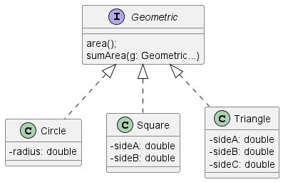
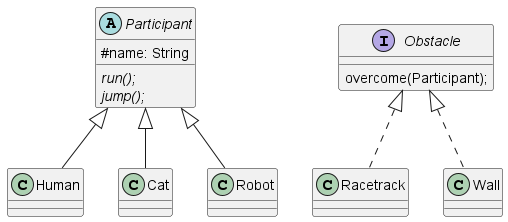

# Домшне завдання 4
### Введення в ООП -> Поліморфізм в Java

Структура майбутьного проєкту

Частина 1.

### Вирішення
1. Строрюємо інтерфейс з двома методами
2. Створюємо класи та імплементуємо інтерфейс
3. В класі Application перевіряємо як воно працює
4. Commit-имо та push-емо його на github

---

Частина 2.

### Вирішення
1. В нашій задачі робимо Participant абстрактним класом, хоча краще булоб інтерфейсом.
2. Obstacle - інтерфейс, це як додаткові можливості.
3. В класі Application перевіряємо як воно працює
4. Commit-имо та push-емо його на github